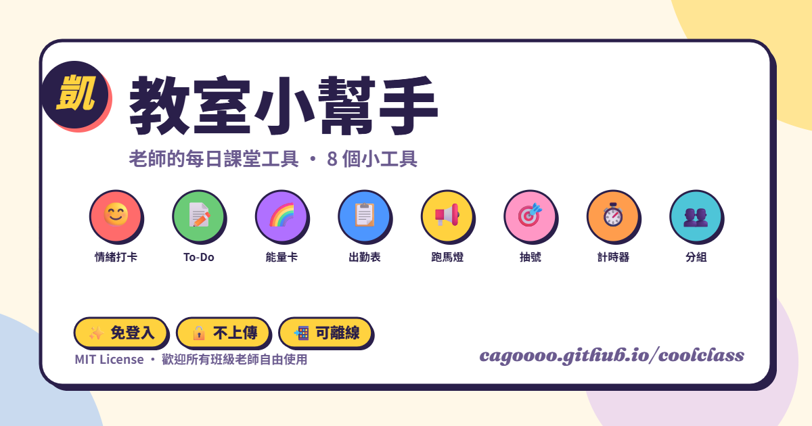

<div align="center">

# 🌈 教室小幫手

### 老師的每日課堂工具 · **26 個免費小工具**

[](https://cagoooo.github.io/coolclass/)
[](https://cagoooo.github.io/coolclass/)
[](CHANGELOG.md)
[](LICENSE)



**✨ 免登入 · 🔒 不上傳 · 📲 可離線 · 🆓 永久免費 · 🎨 Crayon Pop 童趣設計**

</div>

---

## 🎯 給誰用？

**所有國中小、高中、補教、安親班老師**。
打開瀏覽器或裝成 App 就能用，**所有資料只存在你電腦的瀏覽器裡，不會被傳到任何雲端**。

| 場景 | 用得到的工具 |
|---|---|
| 🌅 **晨間活動** | 😊 情緒打卡 ＋ 🌈 今日能量卡 ＋ 🎂 今日壽星 |
| 📚 **上課中** | 🎯 隨機抽號 ＋ ⏱️ 計時器 ＋ 👥 分組 ＋ 🔔 上下課鈴聲 |
| 📋 **班務管理** | 📝 班級 To-Do ＋ 📋 出勤 ＋ 🏆 積點榜 ＋ 🍱 午餐點餐 |
| 📞 **親師溝通** | 📞 親師溝通記錄 ＋ 🎓 學生個人成長報告 ＋ 🎯 行為觀察 |
| 📢 **大屏投影** | 📢 跑馬燈通知 ＋ 📜 班級公約 ＋ 🪑 座位表 |
| ✈️ **特殊活動** | 🎒 戶外教學助手 ＋ 📋 代課交接單 ＋ 🎲 萬用抽籤箱 |
| 📊 **月底交差** | 📊 每月班級報告 ＋ 📈 情緒歷史趨勢 ＋ 💾 一鍵備份 |

---

## 🧰 完整 26 工具一覽

### 🌅 班級基礎五件套（v1.0）
| # | 工具 | 一句話介紹 | 連結 |
|---|---|---|---|
| 01 | 😊 **情緒打卡牆** | 1-N 號學生 × 5 種情緒，三步驟貼牆 | [打開](https://cagoooo.github.io/coolclass/emotion.html) |
| 02 | 📝 **班級 To-Do** | 紅 / 黃 / 綠三欄拖曳，自動存檔 | [打開](https://cagoooo.github.io/coolclass/todo.html) |
| 03 | 🌈 **彩虹能量卡** | 103 句阿德勒風小語，每天「今日心錨」 | [打開](https://cagoooo.github.io/coolclass/cards.html) |
| 04 | 📋 **出勤記錄表** | 4 種狀態、PDF + CSV 雙匯出 | [打開](https://cagoooo.github.io/coolclass/attendance.html) |
| 05 | 📢 **跑馬燈通知** | 8 種主題色、內建時鐘 + 倒數，**v3.6 一鍵自動讀今日重點** | [打開](https://cagoooo.github.io/coolclass/marquee.html) |

### 📚 課堂控場四件套（v2.0）
| # | 工具 | 一句話介紹 | 連結 |
|---|---|---|---|
| 06 | 🎯 **隨機抽號** | 大字幕轉盤 + 抽中音效，公平模式 + 語音播報 | [打開](https://cagoooo.github.io/coolclass/picker.html) |
| 07 | ⏱️ **教室計時器** | 8 預設、4 計時器並行、最後 30 秒警示 | [打開](https://cagoooo.github.io/coolclass/timer.html) |
| 08 | 👥 **隨機分組** | 洗牌 + 組長 👑 + 10 色配對 + 名牌列印 | [打開](https://cagoooo.github.io/coolclass/grouper.html) |
| 09 | 🔔 **上下課鈴聲** | 設課表時間自動播鈴聲 | [打開](https://cagoooo.github.io/coolclass/bell.html) |

### 🏆 班級管理三件套（v3.1）
| # | 工具 | 一句話介紹 | 連結 |
|---|---|---|---|
| 10 | 🏆 **班級積點榜** | 給學生 / 小組加減分，週末公布排行 | [打開](https://cagoooo.github.io/coolclass/points.html) |
| 11 | 📊 **每月班級報告** | 整合出勤 / 情緒 / 待辦 / 能量卡，印 PDF | [打開](https://cagoooo.github.io/coolclass/report.html) |
| 12 | 📈 **情緒歷史趨勢** | 過去 7/14/30/90 天班級情緒堆疊圖 | [打開](https://cagoooo.github.io/coolclass/emotion-history.html) |

### 🎓 學生視角三件套（v3.3）
| # | 工具 | 一句話介紹 | 連結 |
|---|---|---|---|
| 13 | 🎓 **學生個人成長報告** | 整合該學生情緒/出勤/積點，印 PDF 給家長 | [打開](https://cagoooo.github.io/coolclass/student.html) |
| 14 | 💰 **班費記帳** | 收支記帳 + 月底總計 + CSV 給家長 | [打開](https://cagoooo.github.io/coolclass/finance.html) |
| 15 | 🧒 **學生 Kiosk 打卡** | 共用裝置自助模式，學生輪流走過來打卡 | [打開](https://cagoooo.github.io/coolclass/emotion-kiosk.html) |

### 🎉 教室生態三件套（v3.4）
| # | 工具 | 一句話介紹 | 連結 |
|---|---|---|---|
| 16 | 🎲 **萬用抽籤箱** | 任意名單抽籤，可存多組集合 | [打開](https://cagoooo.github.io/coolclass/lottery.html) |
| 17 | 📜 **班級公約** | 編輯班規 → 投影展示 → 印 A4 貼牆 | [打開](https://cagoooo.github.io/coolclass/rules.html) |
| 18 | 🖼️ **學生作品牆** | 拍照上傳作品自動 collage，印 A4 展示 | [打開](https://cagoooo.github.io/coolclass/gallery.html) |

### 🪑 老師日常九件套（v3.5）
| # | 工具 | 一句話介紹 | 連結 |
|---|---|---|---|
| 19 | 🪑 **座位表** | 拖曳排座位 + 換座位歷史 + 印 A4 | [打開](https://cagoooo.github.io/coolclass/seating.html) |
| 20 | 📅 **課表** | 週課表 + 本節 / 下節即時顯示 | [打開](https://cagoooo.github.io/coolclass/schedule.html) |
| 21 | 🎂 **生日榜** | 本月壽星自動提醒，一鍵推到跑馬燈 | [打開](https://cagoooo.github.io/coolclass/birthday.html) |
| 22 | 🍱 **午餐點餐** | 每天勾選訂餐 / 過敏，月底結算 CSV | [打開](https://cagoooo.github.io/coolclass/lunch.html) |
| 23 | 📞 **親師溝通記錄** | 電話/LINE/Email/面談 完整日誌 | [打開](https://cagoooo.github.io/coolclass/contact.html) |
| 24 | 🎯 **行為觀察** | 三色標記，月底自動產報告 | [打開](https://cagoooo.github.io/coolclass/behavior.html) |
| 25 | 📋 **代課交接單** | 5 分鐘填好，代課老師看了就上手 | [打開](https://cagoooo.github.io/coolclass/substitute.html) |
| 26 | 🎒 **戶外教學助手** | 集合點名 + 倒數 + 一鍵撥緊急電話 | [打開](https://cagoooo.github.io/coolclass/field-trip.html) |
| ＋ | 📚 **教案備忘** | 每節課的教學重點、教材、心得 | [打開](https://cagoooo.github.io/coolclass/lesson.html) |

### 🔧 設定與輔助
| 工具 | 一句話介紹 | 連結 |
|---|---|---|
| 👥 **班級名單** | 共用模組，所有工具共用一份名單 | [打開](https://cagoooo.github.io/coolclass/roster.html) |
| 💾 **備份與還原** | 一鍵備份所有班級資料，**v3.6 30 天未備份自動提醒** | [打開](https://cagoooo.github.io/coolclass/backup.html) |
| 📱 **QR Code 工具** | 產生所有工具的 QR Code 印 A4 給學生掃 | [打開](https://cagoooo.github.io/coolclass/qr.html) |

---

## 🚀 三種使用方式

### 方式 1：直接打開網頁（最快）
1. 瀏覽器點 <https://cagoooo.github.io/coolclass/>
2. 第一次會跳出 5 卡 onboarding 引導
3. 點「👥 班級名單設定」輸入班級和學生姓名（Excel 一欄複製貼上也行）
4. 開始用！

### 方式 2：裝成 App（推薦・離線可用）

| 裝置 | 怎麼裝 |
|---|---|
| **Chrome / Edge** | 網址列右邊「安裝」圖示 → 點一下 |
| **iPhone Safari** | 分享 → 加入主畫面 |
| **Android Chrome** | 選單 → 加到主畫面 |

裝完後：
- 主畫面有可愛的笑臉彩虹 icon
- 開啟比網頁快很多
- **沒網路也能開**（戶外教學、機房沒網都不怕）

### 方式 3：Fork 改成自己學校版本

```bash
git clone https://github.com/cagoooo/coolclass.git my-school-tools
cd my-school-tools
# 改 footer 改顏色 改文案 加你想要的功能
bash bump-version.sh "改了什麼"
git push  # 推到你的 GitHub 就會自動部署
```

MIT License — 自由使用、修改、再散佈，不需要徵詢同意。

---

## 🆕 v3.6 推廣升級包亮點

### ✨ 跑馬燈「自動讀今日重點」
跑馬燈頁面新增一鍵按鈕，自動讀取：
- 🌈 今日能量卡引言
- 🎂 今日壽星
- 💗 今日情緒打卡統計
- 📝 未完成的紅 / 黃待辦事項
- ⭐ 本月行為觀察累積
- 🏆 班級積點榜冠軍

→ 自動產生 3〜7 則跑馬燈訊息，**最深度的跨工具整合**。

### 💾 30 天備份提醒
若 30 天未備份 **且確實有累積資料**，右下角會跳粉紅提醒 banner：
- 「立刻備份」→ 直接到備份頁
- 「14 天先別煩我」→ 進入冷靜期
- 在 `backup.html` 完成匯出 / 複製到剪貼簿後自動標記時間戳

→ 防止真實資料消失，**對教學現場最重要的防呆**。

### 📜 CHANGELOG.md
完整版本歷史 v1.0 → v3.6，看完一目了然這個工具走過什麼路。

---

## ⌨️ 鍵盤快捷鍵

| 工具 | 快捷鍵 |
|---|---|
| 🎯 抽號 | **空白鍵** = 抽 |
| ⏱️ 計時器 | **空白鍵** = 開始/暫停、**R** = 重設、**F** = 全螢幕、**Esc** = 離開全螢幕 |
| 📢 跑馬燈 | **空白鍵** = 暫停、**Esc** = 離開全螢幕 |

---

## 🎨 Crayon Pop 設計

v3 改版（2026-04 起）採用**深紫墨色 + 暖奶油底 + 飽和原色 + 粗黑邊 + 偏移實心投影**的童趣風格。

**內建視覺微調面板**（每頁右下角 🎨）：
- 🌈 主色切換：彩虹 / 薄荷 / 日落 / 莓果 / 海洋
- 🌙 深色模式
- ✨ 背景裝飾開關
- 📐 扁平模式（移除所有投影）
- 🔍 字級調整 90%-120%

---

## 🔔 自動更新通知

- 你改完程式 push 上來，**已開啟網頁的老師 3 分鐘內**右下角會跳粉紅 banner「🌈 有新版本了！」
- 按「立刻更新」自動清快取 + reload，直接吃到新版
- **不需要請使用者按 Ctrl+Shift+R**

技術：BUILD_VERSION 占位字串 + Service Worker network-first + version.json polling。

---

## 💾 資料保存與隱私

- 全部資料存在你瀏覽器的 `localStorage` / `IndexedDB`，**不會傳到任何伺服器**
- **同一台電腦同一個瀏覽器**才看得到記錄
- 換電腦 / 清快取 / 無痕視窗 → 舊資料不會帶過去
- **v3.6 起 30 天未備份會主動提醒**
- 建議每月用 `backup.html` 匯出一次 JSON 備份

---

## 🛠️ 技術設計（給想 fork 的老師）

- 純 HTML / CSS / vanilla JS — **無建構流程、無框架、無外部依賴**（僅 Google Fonts）
- localStorage 統一 `akai_*_v1` 命名空間
- IndexedDB 用於存放學生作品圖（避免 localStorage 5MB 限制）
- Service Worker network-first，BUILD_VERSION 占位確保更新一定被偵測
- 響應式設計，手機 / 平板 / 桌機 / 觸控大屏都能用
- 所有頁面都有「← 回主頁」按鈕
- 部署：GitHub Pages（推 main branch 自動上線）

### 主要檔案

```
coolclass/
├── index.html                # 首頁儀表板
├── roster.html / roster.js   # 班級名單設定（必先設定）
├── [26 個工具 .html 檔]      # 完整工具列表見上方表格
├── crayon.css                # v3 設計系統（1100+ 行）
├── tweaks.js                 # 視覺微調面板
├── onboarding.js             # 首次使用引導
├── attendance.js             # 出勤頁邏輯
├── sw.js                     # Service Worker
├── sw-update.js              # 更新通知 + 30 天備份提醒
├── manifest.json             # PWA manifest
├── icon.svg                  # App icon
├── og-image.png              # 社群分享預覽圖
├── version.json              # 版本號（自動產生）
├── bump-version.sh           # 升版腳本
├── CHANGELOG.md              # 版本歷史
├── README.md
├── SHARE.md                  # 教師社群分享文範本
└── LICENSE
```

---

## 📢 推廣與分享

想推薦給其他老師？這邊有現成的分享文範本 → **[SHARE.md](SHARE.md)**

包含：
- 📱 LINE 群組短訊版
- 📘 Facebook 教師社群長文版
- 🗣️ 學校晨會口頭簡介版

---

## 🗺️ 版本歷程一覽

| 版本 | 重點 |
|---|---|
| ✅ **v3.6 推廣升級包** | 跑馬燈自動讀今日重點 + 30 天備份提醒 + CHANGELOG |
| ✅ **v3.5 老師日常 9 工具** | 座位 / 課表 / 生日 / 午餐 / 親師 / 行為 / 代課 / 戶外 / 教案（達 26 工具） |
| ✅ **v3.4 教室生態** | 萬用抽籤 / 班級公約 / 學生作品牆 |
| ✅ **v3.3 學生視角** | Kiosk 打卡 / QR / 個人成長報告 / 班費 / 抽號語音 |
| ✅ **v3.2 RWD 全面響應** | 17 工具完成手機 / 平板 / 大屏適配 |
| ✅ **v3.1 班級管理升級** | 備份 / 報告 / 積點 / 鈴聲 |
| ✅ **v3.0 Crayon Pop 改版** | 童趣設計系統 + onboarding + 視覺微調 |
| ✅ **v2.0 PWA + 自動更新** | 可裝 App / 離線可用 / 自動推送新版 |
| ✅ **v1.0 班級基礎** | 5 大工具上線（情緒/待辦/能量卡/出勤/跑馬燈） |

→ 完整變更記錄請看 [CHANGELOG.md](CHANGELOG.md)

---

## License

MIT — 自由使用、修改、再散佈，**不需要徵詢同意**。
若你做出新版本給你們學校用，歡迎讓我知道（不強制） 🤝

---

<div align="center">

Made with ❤️ by [**阿凱老師**](https://www.smes.tyc.edu.tw/modules/tadnews/page.php?ncsn=11&nsn=16#a5)
桃園市龍潭區石門國民小學「鱻魚特色學園」

</div>
